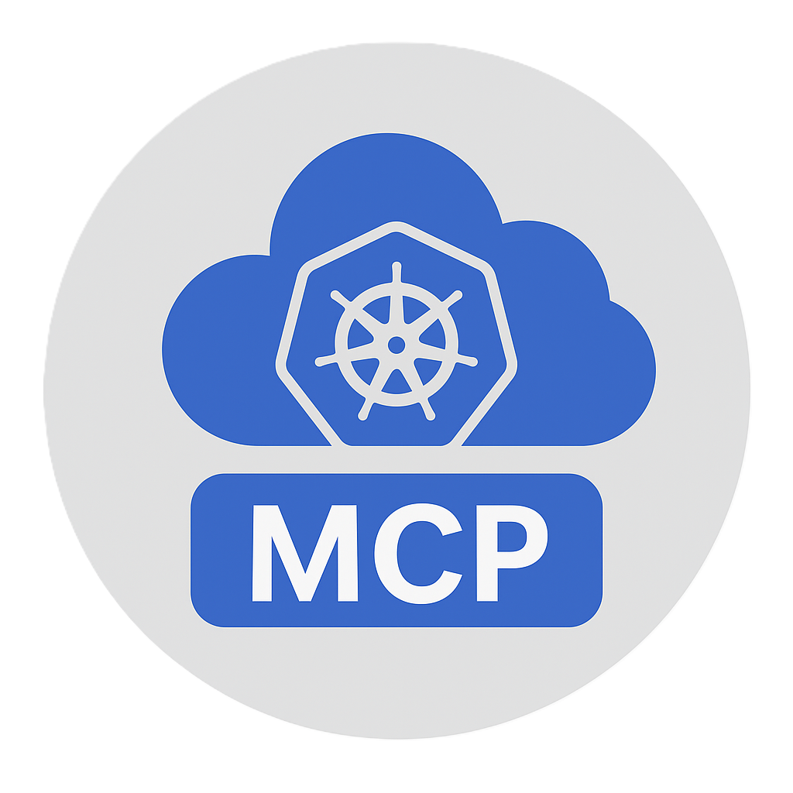

# 🚀 MCP-DevOps Kubernetes 管理系统

[](https://bestpractices.coreinfrastructure.org/projects/569) [](https://goreportcard.com/report/github.com/kubernetes/kubernetes)  [](https://opensource.org/licenses/Apache-2.0) [](http://makeapullrequest.com) [](https://go.dev/)

<div align="center">
  
  <p><em>智能化的 Kubernetes 资源管理与故障诊断系统</em></p>
</div>

<p align="center">
  <a href="#-系统架构">系统架构</a> •
  <a href="#-功能特性">功能特性</a> •
  <a href="#-环境要求">环境要求</a> •
  <a href="#-快速开始">快速开始</a> •
  <a href="#-使用示例">使用示例</a> •
  <a href="#-安全注意事项">安全注意事项</a>
</p>

---

MCP-DevOps 是一个基于 Go 语言开发的 <span style="color:#3498db">Kubernetes 资源管理系统</span>，它提供了简单易用的命令行界面来管理 Kubernetes 集群资源。该系统使用客户端-服务器架构，通过<span style="color:#e74c3c">语义化交互</span>提供直观的操作方式。

## 🏗️ 系统架构

系统由两部分组成：

1. **Server** <span style="color:#27ae60">⚙️</span>：运行在有权限访问 Kubernetes 集群的环境中，提供 Kubernetes 资源操作的 API 接口
2. **Client** <span style="color:#e67e22">🖥️</span>：命令行交互客户端，连接到服务器并提供自然语言交互界面

<details>
<summary>查看架构图</summary>

```
┌─────────────┐       ┌─────────────┐       ┌─────────────┐
│             │       │             │       │             │
│   Client    │◄─────►│   Server    │◄─────►│ Kubernetes  │
│  (AI 交互)   │       │ (API 服务)  │       │   集群      │
│             │       │             │       │             │
└─────────────┘       └─────────────┘       └─────────────┘
```

</details>

## 🌟 功能特性

### <span style="color:#3498db">🔄 Kubernetes 资源管理</span>
<div class="feature-grid">
  <div class="feature-item">
    <span style="color:#e74c3c">🔍 Pod 管理</span>：列出、描述、删除 Pod，查看 Pod 日志
  </div>
  <div class="feature-item">
    <span style="color:#2ecc71">🚀 Deployment 管理</span>：列出、描述、扩缩容、重启 Deployment
  </div>
  <div class="feature-item">
    <span style="color:#9b59b6">📊 StatefulSet 管理</span>：列出、描述、扩缩容、重启 StatefulSet
  </div>
  <div class="feature-item">
    <span style="color:#f39c12">🔌 Service 管理</span>：列出、描述、修改 Service
  </div>
  <div class="feature-item">
    <span style="color:#16a085">🏷️ Namespace 管理</span>：列出、描述、创建、删除 Namespace
  </div>
  <div class="feature-item">
    <span style="color:#2980b9">🌐 Ingress 管理</span>：列出、描述、创建、更新、删除 Ingress
  </div>
  <div class="feature-item">
    <span style="color:#c0392b">⚙️ ConfigMap 管理</span>：列出、描述、创建、更新、删除 ConfigMap
  </div>
  <div class="feature-item">
    <span style="color:#8e44ad">🔒 Secret 管理</span>：列出、描述、创建、更新、删除 Secret
  </div>
</div>

### <span style="color:#e74c3c">🚨 故障诊断与告警处理</span>
- <span style="color:#3498db">🏥 集群健康检查</span>：获取集群整体健康状态，包括节点、Pod 和命名空间状态
- <span style="color:#2ecc71">🔍 Pod 诊断</span>：深入分析 Pod 问题，检查容器状态、事件和日志，提供解决建议
- <span style="color:#e67e22">📊 节点诊断</span>：检查节点状态、资源使用情况和运行的 Pod，识别潜在问题
- <span style="color:#9b59b6">🚀 Deployment 诊断</span>：分析 Deployment 部署和更新问题，检查副本状态和事件
- <span style="color:#f1c40f">⚠️ 告警分析</span>：处理和分析 Prometheus/Alertmanager 告警，提供根本原因分析和解决方案
- <span style="color:#1abc9c">📱 企业微信通知</span>：支持发送文本、Markdown 和卡片类型的企业微信消息，用于告警通知和状态报告
- <span style="color:#34495e">🔔 Alertmanager Webhook 集成</span>：客户端内置 Webhook 监听器（默认端口 9094），可接收 Alertmanager 告警，交由 AI 分析并通过企业微信发送通知

### <span style="color:#2ecc71">🐧 Linux 系统排查</span>
- <span style="color:#3498db">💻 系统信息</span>：获取主机基本信息，包括操作系统、内核版本、资源使用情况等
- <span style="color:#e74c3c">⚙️ 进程管理</span>：查看和分析进程状态，识别高 CPU 或内存使用的进程
- <span style="color:#f39c12">📈 资源监控</span>：监控 CPU、内存和磁盘使用情况，识别资源瓶颈
- <span style="color:#9b59b6">🌐 网络诊断</span>：检查网络连接、接口状态和路由配置，排查网络问题
- <span style="color:#2980b9">📝 日志分析</span>：分析系统日志文件，查找错误和警告信息
- <span style="color:#16a085">🔄 服务状态</span>：检查系统服务运行状态，管理服务启停

### <span style="color:#9b59b6">⚙️ Kubernetes 组件排查</span>
- <span style="color:#e74c3c">🔄 Kubelet 状态</span>：检查 Kubelet 服务状态和日志，排查节点问题
- <span style="color:#3498db">🐳 容器运行时</span>：检查 Docker、Containerd 或 CRI-O 状态，排查容器问题
- <span style="color:#f1c40f">🔌 Kube-Proxy</span>：检查 Kube-Proxy 状态和配置，排查服务网络问题
- <span style="color:#2ecc71">🌐 CNI 状态</span>：检查网络插件状态和配置，排查 Pod 网络问题
- <span style="color:#8e44ad">📝 组件日志</span>：分析 Kubernetes 组件日志，查找错误和警告信息
- <span style="color:#e67e22">🔍 容器检查</span>：检查容器详情和日志，深入排查应用问题

### <span style="color:#f39c12">🤖 交互与用户体验</span>
- <span style="color:#3498db">💬 自然语言交互</span>：通过自然语言描述你想执行的操作
- <span style="color:#e74c3c">🇨🇳 中文支持</span>：系统默认使用中文进行交互
- <span style="color:#2ecc71">🧠 智能故障分析</span>：AI 自动分析故障模式并提供解决方案
- <span style="color:#9b59b6">🚨 告警智能处理</span>：自动分析告警信息，执行诊断步骤，提供详细报告

---

## 🛠️ 环境要求

<div align="center">
  <table>
    <tr>
      <td align="center"><span style="color:#3498db">🔧</span></td>
      <td><b>Go 1.23.0</b> 或更高版本</td>
    </tr>
    <tr>
      <td align="center"><span style="color:#e74c3c">📄</span></td>
      <td><b>Kubernetes 集群</b>的访问配置（kubeconfig 文件）</td>
    </tr>
    <tr>
      <td align="center"><span style="color:#2ecc71">🔑</span></td>
      <td><b>OpenAI API</b> 或兼容的大语言模型 API</td>
    </tr>
    <tr>
      <td align="center"><span style="color:#f39c12">🔔</span></td>
      <td><b>企业微信</b> Webhook URL（用于告警通知）</td>
    </tr>
  </table>
</div>

## 🚀 快速开始

<details open>
<summary><span style="color:#3498db; font-weight:bold;">💼 环境配置</span></summary>

1. 克隆仓库并进入项目目录
   ```bash
   git clone https://github.com/yourusername/mcp-devops.git
   cd mcp-devops
   ```

2. 配置 `.env` 文件（项目根目录已提供示例）：

   ```ini
   # 服务器配置
   MCP_SERVER_ADDRESS=0.0.0.0:12345
   API_KEY=your-secret-api-key

   # 客户端配置
   MCP_SERVER_URL=http://127.0.0.1:12345/sse
   OPENAI_API_KEY=your-openai-api-key
   OPENAI_BASE_URL=https://dashscope.aliyuncs.com/compatible-mode/v1
   OPENAI_MODEL=qwen-max

   # 企业微信配置
   WECHAT_WEBHOOK_URL=https://qyapi.weixin.qq.com/cgi-bin/webhook/send?key=your-webhook-key
   ```
</details>

<details open>
<summary><span style="color:#2ecc71; font-weight:bold;">⚙️ 启动服务器</span></summary>

```bash
cd server
go run main.go
```

服务器将监听配置的地址和端口，为客户端提供 Kubernetes 资源管理 API。

<div style="background-color: #f8f9fa; border-left: 4px solid #2ecc71; padding: 10px; margin: 10px 0;">
  <span style="color:#2ecc71">💡 提示：</span> 确保服务器有权限访问 Kubernetes 集群。如果在集群外运行，请正确配置 kubeconfig 文件。
</div>
</details>

<details open>
<summary><span style="color:#e74c3c; font-weight:bold;">🖥️ 启动客户端</span></summary>

```bash
cd client
go run main.go
```

客户端启动后，会连接到服务器并提供命令行交互界面。同时，它会在后台启动一个 Webhook 监听器（默认监听 `http://localhost:9094/webhook`）用于接收 Alertmanager 告警。

<div style="background-color: #f8f9fa; border-left: 4px solid #3498db; padding: 10px; margin: 10px 0;">
  <span style="color:#3498db">🔔 注意：</span> 首次启动时，客户端会尝试连接服务器并获取可用工具列表。如果连接失败，将自动重试。
</div>
</details>

---

## 💬 使用示例

客户端启动后，您可以使用自然语言输入以下示例命令：

<details open>
<summary><span style="color:#3498db; font-weight:bold;">🔄 Kubernetes 资源管理</span></summary>

<table>
  <tr>
    <th>功能</th>
    <th>示例命令</th>
  </tr>
  <tr>
    <td><span style="color:#16a085">查看命名空间</span></td>
    <td><code>查看所有命名空间</code></td>
  </tr>
  <tr>
    <td><span style="color:#e74c3c">查看 Pod</span></td>
    <td><code>查看 default 命名空间中的所有 Pod</code></td>
  </tr>
  <tr>
    <td><span style="color:#9b59b6">Pod 详情</span></td>
    <td><code>描述 pod-name 这个 Pod</code></td>
  </tr>
  <tr>
    <td><span style="color:#3498db">查看日志</span></td>
    <td><code>查看 pod-name 的日志</code></td>
  </tr>
  <tr>
    <td><span style="color:#2ecc71">扩展 Deployment</span></td>
    <td><code>将 deployment-name 扩展到 3 个副本</code></td>
  </tr>
  <tr>
    <td><span style="color:#f39c12">创建 ConfigMap</span></td>
    <td><code>创建一个名为 app-config 的 ConfigMap，包含 key1=value1 和 key2=value2</code></td>
  </tr>
  <tr>
    <td><span style="color:#2980b9">创建 Ingress</span></td>
    <td><code>为 my-service 服务创建一个 Ingress，主机名为 example.com，路径为 /api</code></td>
  </tr>
  <tr>
    <td><span style="color:#8e44ad">更新 Secret</span></td>
    <td><code>更新 my-secret，添加 username=admin 和 password=secure123</code></td>
  </tr>
</table>
</details>

<details open>
<summary><span style="color:#e74c3c; font-weight:bold;">🚨 故障诊断与告警处理</span></summary>

<table>
  <tr>
    <th>功能</th>
    <th>示例命令</th>
  </tr>
  <tr>
    <td><span style="color:#3498db">集群健康检查</span></td>
    <td><code>检查集群健康状态</code></td>
  </tr>
  <tr>
    <td><span style="color:#e74c3c">Pod 诊断</span></td>
    <td><code>诊断 Pod my-pod 的问题</code></td>
  </tr>
  <tr>
    <td><span style="color:#2ecc71">节点诊断</span></td>
    <td><code>诊断节点 worker-1 的问题</code></td>
  </tr>
  <tr>
    <td><span style="color:#f39c12">Deployment 诊断</span></td>
    <td><code>分析 Deployment my-app 的问题</code></td>
  </tr>
  <tr>
    <td><span style="color:#9b59b6">告警分析</span></td>
    <td><code>分析 CPU 使用率高的告警，节点是 worker-1，严重性是 warning</code></td>
  </tr>
  <tr>
    <td><span style="color:#1abc9c">企业微信通知</span></td>
    <td><code>发送企业微信消息"Kubernetes集群重启完成"</code></td>
  </tr>
</table>
</details>

<details>
<summary><span style="color:#2ecc71; font-weight:bold;">🐧 Linux 系统排查</span></summary>

<table>
  <tr>
    <th>功能</th>
    <th>示例命令</th>
  </tr>
  <tr>
    <td><span style="color:#3498db">系统信息</span></td>
    <td><code>获取节点 worker-1 的系统信息</code></td>
  </tr>
  <tr>
    <td><span style="color:#e74c3c">进程信息</span></td>
    <td><code>查看节点 worker-1 上的 kubelet 进程</code></td>
  </tr>
  <tr>
    <td><span style="color:#f39c12">资源使用情况</span></td>
    <td><code>查看节点 worker-1 的资源使用情况</code></td>
  </tr>
  <tr>
    <td><span style="color:#9b59b6">日志分析</span></td>
    <td><code>分析节点 worker-1 上的 /var/log/syslog 日志，查找 error 关键字</code></td>
  </tr>
  <tr>
    <td><span style="color:#2980b9">服务状态</span></td>
    <td><code>检查节点 worker-1 上的 docker 服务状态</code></td>
  </tr>
</table>
</details>

<details>
<summary><span style="color:#9b59b6; font-weight:bold;">⚙️ Kubernetes 组件排查</span></summary>

<table>
  <tr>
    <th>功能</th>
    <th>示例命令</th>
  </tr>
  <tr>
    <td><span style="color:#e74c3c">Kubelet 状态</span></td>
    <td><code>检查节点 worker-1 上的 Kubelet 状态</code></td>
  </tr>
  <tr>
    <td><span style="color:#3498db">容器运行时</span></td>
    <td><code>检查节点 worker-1 上的 containerd 状态</code></td>
  </tr>
  <tr>
    <td><span style="color:#f1c40f">Kube-Proxy</span></td>
    <td><code>检查节点 worker-1 上的 Kube-Proxy 状态</code></td>
  </tr>
  <tr>
    <td><span style="color:#2ecc71">CNI 状态</span></td>
    <td><code>检查节点 worker-1 上的 calico 状态</code></td>
  </tr>
  <tr>
    <td><span style="color:#8e44ad">组件日志</span></td>
    <td><code>查看节点 worker-1 上的 kubelet 日志</code></td>
  </tr>
  <tr>
    <td><span style="color:#e67e22">容器检查</span></td>
    <td><code>检查节点 worker-1 上的容器 abc123 的详情</code></td>
  </tr>
</table>
</details>

---

## 🔒 安全注意事项

<div style="background-color: #f8f9fa; border-left: 4px solid #e74c3c; padding: 15px; margin: 15px 0; border-radius: 4px;">
  <h3 style="color:#e74c3c; margin-top: 0;">⚠️ 重要安全提示</h3>
  <ul>
    <li><b>服务器部署环境</b>：服务器应部署在安全的环境中，因为它具有 Kubernetes 集群的访问权限</li>
    <li><b>认证机制</b>：生产环境中应配置合适的认证机制，避免未授权访问</li>
    <li><b>操作确认</b>：对于危险操作（如删除资源），客户端将提供安全提示和确认机制</li>
    <li><b>权限控制</b>：建议为服务器使用的 Kubernetes 服务账号配置最小必要权限</li>
    <li><b>API 密钥保护</b>：确保 API 密钥和 Webhook URL 等敏感信息得到妥善保护</li>
  </ul>
</div>

## 📁 项目结构

<details open>
<summary><span style="color:#3498db; font-weight:bold;">项目文件结构</span></summary>

```
mcp-devops/
├── client/                # 客户端代码
│   ├── main.go            # 客户端主程序
│   └── pkg/               # 客户端包
│       ├── model/         # 模型相关代码
│       └── mcp/           # MCP 客户端实现
├── server/                # 服务器代码
│   ├── main.go            # 服务器主程序
│   ├── k8s/               # Kubernetes 操作工具
│   │   ├── client.go      # Kubernetes 客户端
│   │   ├── pod.go         # Pod 相关操作
│   │   ├── deployment.go  # Deployment 相关操作
│   │   ├── service.go     # Service 相关操作
│   │   ├── statefulset.go # StatefulSet 相关操作
│   │   ├── namespace.go   # Namespace 相关操作
│   │   ├── ingress.go     # Ingress 相关操作
│   │   ├── configmap.go   # ConfigMap 相关操作
│   │   ├── secret.go      # Secret 相关操作
│   │   ├── troubleshoot.go # 故障诊断工具
│   │   └── wechat.go      # 企业微信通知
│   ├── linux/             # Linux 系统操作工具
│   │   ├── system.go      # 系统信息和资源监控
│   │   └── kubernetes.go  # Kubernetes 组件排查
│   └── sse/               # SSE 服务实现
│       └── server.go      # SSE 服务器
├── .env                   # 环境配置文件
├── go.mod                 # Go 模块定义
└── go.sum                 # Go 依赖校验
```
</details>

## 🔧 开发与扩展

<div style="background-color: #f8f9fa; border-left: 4px solid #2ecc71; padding: 15px; margin: 15px 0; border-radius: 4px;">
  <h3 style="color:#2ecc71; margin-top: 0;">💡 扩展指南</h3>
  
  <p>如需添加新的 Kubernetes 资源管理功能，您可以按照以下步骤进行：</p>
  
  <ol>
    <li>在 <code>server/k8s/</code> 目录中添加相应的处理函数</li>
    <li>在 <code>server/sse/server.go</code> 中注册新的工具</li>
    <li>重启服务器和客户端</li>
  </ol>
  
  <p><b>示例</b>：添加对 CronJob 资源的支持</p>
  
  <pre><code>// 1. 创建 server/k8s/cronjob.go 文件实现相关功能
// 2. 在 server/sse/server.go 中注册工具：
svr.AddTool(mcp.NewTool("list_cronjobs",
    mcp.WithDescription("列出指定命名空间中的所有CronJob"),
    mcp.WithString("namespace",
        mcp.Description("要查询的命名空间, 默认为default"),
        mcp.DefaultString("default"),
    ),
), k8s.ListCronJobsTool)
// 3. 重启服务器和客户端</code></pre>
</div>

## ⚠️ 注意事项

<div class="notice-container">
  <div style="background-color: #f8f9fa; border-left: 4px solid #3498db; padding: 10px; margin: 10px 0; border-radius: 4px;">
    <p><span style="color:#3498db">🔑</span> <b>API 密钥</b>：客户端需要使用大语言模型 API，请确保 OPENAI_API_KEY 有效</p>
  </div>
  
  <div style="background-color: #f8f9fa; border-left: 4px solid #e74c3c; padding: 10px; margin: 10px 0; border-radius: 4px;">
    <p><span style="color:#e74c3c">⚙️</span> <b>Kubernetes 配置</b>：如果在集群外运行服务器，请确保正确配置了 kubeconfig</p>
  </div>
  
  <div style="background-color: #f8f9fa; border-left: 4px solid #2ecc71; padding: 10px; margin: 10px 0; border-radius: 4px;">
    <p><span style="color:#2ecc71">🤖</span> <b>模型选择</b>：默认配置使用阿里通义模型 API，可以根据需要更换为其他 API</p>
  </div>
  
  <div style="background-color: #f8f9fa; border-left: 4px solid #f39c12; padding: 10px; margin: 10px 0; border-radius: 4px;">
    <p><span style="color:#f39c12">📱</span> <b>企业微信</b>：企业微信通知功能需要配置有效的企业微信群机器人 Webhook URL</p>
  </div>
  
  <div style="background-color: #f8f9fa; border-left: 4px solid #9b59b6; padding: 10px; margin: 10px 0; border-radius: 4px;">
    <p><span style="color:#9b59b6">🔔</span> <b>告警集成</b>：如需使用 Alertmanager 告警集成，请配置 Alertmanager 将告警发送到客户端运行机器的 <code>http://&lt;client-ip&gt;:9094/webhook</code> 地址</p>
  </div>
</div>

---

<div align="center">
  <p>Made with ❤️ by MCP-DevOps Team</p>
  <p>
    <a href="https://github.com/yourusername/mcp-devops">GitHub</a> •
    <a href="https://github.com/yourusername/mcp-devops/issues">Issues</a> •
    <a href="https://github.com/yourusername/mcp-devops/wiki">Wiki</a>
  </p>
</div>
