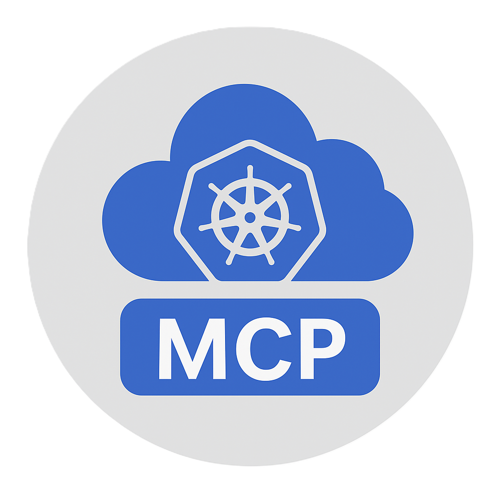

# 🚀 MCP-DevOps Kubernetes 管理系统

[](https://bestpractices.coreinfrastructure.org/projects/569) [](https://goreportcard.com/report/github.com/kubernetes/kubernetes)  [](https://opensource.org/licenses/Apache-2.0) [](http://makeapullrequest.com) [](https://go.dev/)

<div align="center">
  
  <p><em>智能化的 Kubernetes 资源管理与故障诊断系统</em></p>
</div>

<p align="center">
  <a href="#-系统架构">系统架构</a> •
  <a href="#-功能特性">功能特性</a> •
  <a href="#-环境要求">环境要求</a> •
  <a href="#-快速开始">快速开始</a> •
  <a href="#-使用示例">使用示例</a> •
  <a href="#-安全注意事项">安全注意事项</a>
</p>

---

MCP-DevOps 是一个基于 Go 语言开发的 <span style="color:#3498db">Kubernetes 资源管理系统</span>，它提供了简单易用的命令行界面来管理 Kubernetes 集群资源。该系统使用客户端-服务器架构，通过<span style="color:#e74c3c">语义化交互</span>提供直观的操作方式。

## 🏗️ 系统架构

系统由两部分组成：

1. **Server** <span style="color:#27ae60">⚙️</span>：运行在有权限访问 Kubernetes 集群的环境中，提供 Kubernetes 资源操作的 API 接口
2. **Client** <span style="color:#e67e22">🖥️</span>：命令行交互客户端，连接到服务器并提供自然语言交互界面

<details>
<summary>查看架构图</summary>

```
┌─────────────┐       ┌─────────────┐       ┌─────────────┐
│             │       │             │       │             │
│   Client    │◄─────►│   Server    │◄─────►│ Kubernetes  │
│  (AI 交互)   │       │ (API 服务)  │       │   集群      │
│             │       │             │       │             │
└─────────────┘       └─────────────┘       └─────────────┘
```

</details>

## 🌟 功能特性

### <span style="color:#3498db">🔄 Kubernetes 资源管理</span>
<div class="feature-grid">
  <div class="feature-item">
    <span style="color:#e74c3c">🔍 Pod 管理</span>：列出、描述、删除 Pod，查看 Pod 日志
  </div>
  <div class="feature-item">
    <span style="color:#2ecc71">🚀 Deployment 管理</span>：列出、描述、扩缩容、重启 Deployment
  </div>
  <div class="feature-item">
    <span style="color:#9b59b6">📊 StatefulSet 管理</span>：列出、描述、扩缩容、重启 StatefulSet
  </div>
  <div class="feature-item">
    <span style="color:#f39c12">🔌 Service 管理</span>：列出、描述、修改 Service
  </div>
  <div class="feature-item">
    <span style="color:#16a085">🏷️ Namespace 管理</span>：列出、描述、创建、删除 Namespace
  </div>
  <div class="feature-item">
    <span style="color:#2980b9">🌐 Ingress 管理</span>：列出、描述、创建、更新、删除 Ingress
  </div>
  <div class="feature-item">
    <span style="color:#c0392b">⚙️ ConfigMap 管理</span>：列出、描述、创建、更新、删除 ConfigMap
  </div>
  <div class="feature-item">
    <span style="color:#8e44ad">🔒 Secret 管理</span>：列出、描述、创建、更新、删除 Secret
  </div>
</div>

### <span style="color:#e74c3c">🚨 故障诊断与告警处理</span>
- <span style="color:#3498db">🏥 集群健康检查</span>：获取集群整体健康状态，包括节点、Pod 和命名空间状态
- <span style="color:#e74c3c">🔍 Pod 诊断</span>：深入分析 Pod 问题，检查容器状态、事件和日志，提供解决建议
- <span style="color:#2ecc71">📊 节点诊断</span>：检查节点状态、资源使用情况和运行的 Pod，识别潜在问题
- <span style="color:#e67e22">🚀 Deployment 诊断</span>：分析 Deployment 部署和更新问题，检查副本状态和事件
- <span style="color:#f1c40f">⚠️ 告警分析</span>：处理和分析 Prometheus/Alertmanager 告警，提供根本原因分析和解决方案
- <span style="color:#1abc9c">📱 企业微信通知</span>：支持发送文本、Markdown 和卡片类型的企业微信消息，用于告警通知和状态报告
- <span style="color:#34495e">🔔 Alertmanager Webhook 集成</span>：客户端内置 Webhook 监听器（默认端口 9094），可接收 Alertmanager 告警，交由 AI 分析并通过企业微信发送通知

### <span style="color:#f39c12">📜 Loki日志分析与通知</span>
- <span style="color:#3498db">🔎 日志查询</span>：查询指定服务的Loki日志，支持最近30分钟或自定义时间范围的日志查看
- <span style="color:#e74c3c">📊 日志分析</span>：分析服务日志，提取关键信息和模式，提供运行状态总结
- <span style="color:#2ecc71">📤 通知发送</span>：将日志分析结果通过企业微信发送，支持中文内容，确保团队及时了解服务状态

### <span style="color:#8e44ad">🔍 ClickHouse 链路追踪分析</span>
- <span style="color:#3498db">📊 服务深度分析</span>：针对单个服务进行全方位性能分析，包括调用模式、错误率、延迟分布等
- <span style="color:#e74c3c">🔗 Trace 链路分析</span>：深度分析单个 trace_id 的完整调用链路，识别性能瓶颈和异常行为
- <span style="color:#2ecc71">🎯 异常追踪</span>：自动查找包含错误 spans 的 trace，快速定位问题来源
- <span style="color:#f39c12">⚡ 性能优化</span>：识别慢查询、大跨度链路和性能异常，提供优化建议
- <span style="color:#9b59b6">📈 时间趋势</span>：分析服务在不同时间段的性能表现，识别性能劣化趋势
- <span style="color:#e67e22">🔄 依赖分析</span>：分析服务间的调用关系和依赖模式，优化服务架构
- <span style="color:#1abc9c">🚨 健康评估</span>：基于错误率和延迟自动评估服务健康状态，提供诊断建议

### <span style="color:#2ecc71">🐧 Linux 系统排查</span>
- <span style="color:#3498db">💻 系统信息</span>：获取主机基本信息，包括操作系统、内核版本、资源使用情况等
- <span style="color:#e74c3c">⚙️ 进程管理</span>：查看和分析进程状态，识别高 CPU 或内存使用的进程
- <span style="color:#f39c12">📈 资源监控</span>：监控 CPU、内存和磁盘使用情况，识别资源瓶颈
- <span style="color:#9b59b6">🌐 网络诊断</span>：检查网络连接、接口状态和路由配置，排查网络问题
- <span style="color:#2980b9">📝 日志分析</span>：分析系统日志文件，查找错误和警告信息
- <span style="color:#16a085">🔄 服务状态</span>：检查系统服务运行状态，管理服务启停

### <span style="color:#9b59b6">⚙️ Kubernetes 组件排查</span>
- <span style="color:#e74c3c">🔄 Kubelet 状态</span>：检查 Kubelet 服务状态和日志，排查节点问题
- <span style="color:#3498db">🐳 容器运行时</span>：检查 Docker、Containerd 或 CRI-O 状态，排查容器问题
- <span style="color:#f1c40f">🔌 Kube-Proxy</span>：检查 Kube-Proxy 状态和配置，排查服务网络问题
- <span style="color:#2ecc71">🌐 CNI 状态</span>：检查网络插件状态和配置，排查 Pod 网络问题
- <span style="color:#8e44ad">📝 组件日志</span>：分析 Kubernetes 组件日志，查找错误和警告信息
- <span style="color:#e67e22">🔍 容器检查</span>：检查容器详情和日志，深入排查应用问题

### <span style="color:#e67e22">🔑 Redis 工具</span>
- <span style="color:#3498db">📊 Redis 信息</span>：获取 Redis 服务器运行时信息
- <span style="color:#e74c3c">⏱️ 慢查询分析</span>：分析 Redis 慢查询日志
- <span style="color:#2ecc71">🔍 大键查找</span>：查找 Redis 中的大键（超过 1MB）
- <span style="color:#f39c12">🔥 热键查找</span>：查找 Redis 中的热键
- <span style="color:#9b59b6">👀 命令监控</span>：实时查看 Redis 执行的命令流（高负载，慎用）
- <span style="color:#2980b9">📉 延迟测量</span>：测量 Redis 的延迟
- <span style="color:#16a085">📈 延迟历史</span>：测量 Redis 延迟并获取历史数据
- <span style="color:#8e44ad">📊 统计信息</span>：实时查看 Redis 简洁统计信息

### <span style="color:#f39c12">🤖 交互与用户体验</span>
- <span style="color:#3498db">💬 自然语言交互</span>：通过自然语言描述你想执行的操作
- <span style="color:#e74c3c">🇨🇳 中文支持</span>：系统默认使用中文进行交互
- <span style="color:#2ecc71">🧠 智能故障分析</span>：AI 自动分析故障模式并提供解决方案
- <span style="color:#9b59b6">🚨 告警智能处理</span>：自动分析告警信息，执行诊断步骤，提供详细报告

---

## 🛠️ 环境要求

<div align="center">
  <table>
    <tr>
      <td align="center"><span style="color:#3498db">🔧</span></td>
      <td><b>Go 1.23.0</b> 或更高版本</td>
    </tr>
    <tr>
      <td align="center"><span style="color:#e74c3c">📄</span></td>
      <td><b>Kubernetes 集群</b>的访问配置（kubeconfig 文件）</td>
    </tr>
    <tr>
      <td align="center"><span style="color:#2ecc71">🔑</span></td>
      <td><b>OpenAI API</b> 或兼容的大语言模型 API</td>
    </tr>
    <tr>
      <td align="center"><span style="color:#8e44ad">🗄️</span></td>
      <td><b>ClickHouse 数据库</b>（可选，用于链路追踪分析功能）</td>
    </tr>
    <tr>
      <td align="center"><span style="color:#f39c12">📊</span></td>
      <td><b>Loki 日志系统</b>（可选，用于日志分析功能）</td>
    </tr>
  </table>
</div>

## 🚀 快速开始

<details open>
<summary><span style="color:#3498db; font-weight:bold;">💼 环境配置</span></summary>

1. 克隆仓库并进入项目目录
   ```bash
   git clone https://github.com/yourusername/mcp-devops.git
   cd mcp-devops
   ```

2. 配置 `.env` 文件（项目根目录已提供示例）：   ```ini
   # 服务器配置
   MCP_SERVER_ADDRESS=0.0.0.0:12345
   API_KEY=[your-secret-api-key]

   # 客户端配置
   MCP_SERVER_URL=http://127.0.0.1:12345/sse
   ModelType=openai
   OPENAI_API_KEY=[your-openai-api-key]
   OPENAI_BASE_URL=[your-openai-base-url]
   OPENAI_MODEL=[your-openai-model]
   OLLAMA_BASE_URL=[your-ollama-base-url]
   OLLAMA_MODEL=[your-ollama-model]
   PORT=8080

   # ClickHouse 配置（可选，用于链路追踪分析）
   CLICKHOUSE_ADDRESS=[your-clickhouse-host:port]
   CLICKHOUSE_USERNAME=[your-clickhouse-username]
   CLICKHOUSE_PASSWORD=[your-clickhouse-password]
   CLICKHOUSE_DATABASE=[your-clickhouse-database]

   # Loki 配置（可选，用于日志分析）
   LOKI_ADDRESS=[your-loki-address]

   # 企业微信配置（可选，用于消息通知）
   WECHAT_WEBHOOK_URL=[your-wechat-webhook-url]
   ```
</details>

<details open>
<summary><span style="color:#2ecc71; font-weight:bold;">⚙️ 启动服务器</span></summary>

```bash
cd server
go run main.go
```

服务器将监听配置的地址和端口，为客户端提供 Kubernetes 资源管理 API。

<div style="background-color: #f8f9fa; border-left: 4px solid #2ecc71; padding: 10px; margin: 10px 0;">
  <span style="color:#2ecc71">💡 提示：</span> 确保服务器有权限访问 Kubernetes 集群。如果在集群外运行，请正确配置 kubeconfig 文件。
</div>
</details>

<details open>
<summary><span style="color:#e74c3c; font-weight:bold;">🖥️ 启动命令行客户端</span></summary>

```bash
cd client
go run main.go
```

命令行客户端启动后，会连接到服务器并提供命令行交互界面。同时，它会在后台启动一个 Webhook 监听器（默认监听 `http://localhost:8080/webhook`）用于接收 Alertmanager 告警。

<div style="background-color: #f8f9fa; border-left: 4px solid #3498db; padding: 10px; margin: 10px 0;">
  <span style="color:#3498db">🔔 注意：</span> 首次启动时，客户端会尝试连接服务器并获取可用工具列表。如果连接失败，将自动重试。
</div>
</details>

---

## 💬 使用示例

客户端启动后，您可以使用自然语言输入以下示例命令：

<details open>
<summary><span style="color:#3498db; font-weight:bold;">🔄 Kubernetes 资源管理</span></summary>

<table>
  <tr>
    <th>功能</th>
    <th>示例命令</th>
  </tr>
  <tr>
    <td><span style="color:#16a085">查看命名空间</span></td>
    <td><code>查看所有命名空间</code></td>
  </tr>
  <tr>
    <td><span style="color:#e74c3c">查看 Pod</span></td>
    <td><code>查看 default 命名空间中的所有 Pod</code></td>
  </tr>
  <tr>
    <td><span style="color:#9b59b6">Pod 详情</span></td>
    <td><code>描述 pod-name 这个 Pod</code></td>
  </tr>
  <tr>
    <td><span style="color:#3498db">查看日志</span></td>
    <td><code>查看 pod-name 的日志</code></td>
  </tr>
  <tr>
    <td><span style="color:#2ecc71">扩展 Deployment</span></td>
    <td><code>将 deployment-name 扩展到 3 个副本</code></td>
  </tr>
  <tr>
    <td><span style="color:#f39c12">创建 ConfigMap</span></td>
    <td><code>创建一个名为 app-config 的 ConfigMap，包含 key1=value1 和 key2=value2</code></td>
  </tr>
  <tr>
    <td><span style="color:#2980b9">创建 Ingress</span></td>
    <td><code>为 my-service 服务创建一个 Ingress，主机名为 example.com，路径为 /api</code></td>
  </tr>
  <tr>
    <td><span style="color:#8e44ad">更新 Secret</span></td>
    <td><code>更新 my-secret，添加 username=admin 和 password=secure123</code></td>
  </tr>
</table>
</details>

<details open>
<summary><span style="color:#e74c3c; font-weight:bold;">🚨 故障诊断与告警处理</span></summary>

<table>
  <tr>
    <th>功能</th>
    <th>示例命令</th>
  </tr>
  <tr>
    <td><span style="color:#3498db">集群健康检查</span></td>
    <td><code>检查集群健康状态</code></td>
  </tr>
  <tr>
    <td><span style="color:#e74c3c">Pod 诊断</span></td>
    <td><code>诊断 Pod my-pod 的问题</code></td>
  </tr>
  <tr>
    <td><span style="color:#2ecc71">节点诊断</span></td>
    <td><code>诊断节点 worker-1 的问题</code></td>
  </tr>
  <tr>
    <td><span style="color:#f39c12">Deployment 诊断</span></td>
    <td><code>分析 Deployment my-app 的问题</code></td>
  </tr>
  <tr>
    <td><span style="color:#9b59b6">告警分析</span></td>
    <td><code>分析 CPU 使用率高的告警，节点是 worker-1，严重性是 warning</code></td>
  </tr>
  <tr>
    <td><span style="color:#1abc9c">企业微信通知</span></td>
    <td><code>发送企业微信消息"Kubernetes集群重启完成"</code></td>
  </tr>
</table>
</details>

<details>
<summary><span style="color:#8e44ad; font-weight:bold;">🔍 ClickHouse 链路追踪分析</span></summary>

<table>
  <tr>
    <th>功能</th>
    <th>示例命令</th>
  </tr>
  <tr>
    <td><span style="color:#3498db">服务深度分析</span></td>
    <td><code>分析 user-service 服务的性能，时间范围 24 小时</code></td>
  </tr>
  <tr>
    <td><span style="color:#e74c3c">Trace 详细分析</span></td>
    <td><code>分析 trace ID 为 abc123xyz789 的完整调用链路</code></td>
  </tr>
  <tr>
    <td><span style="color:#2ecc71">深度追踪分析</span></td>
    <td><code>深度分析 trace ID abc123xyz789 的性能瓶颈</code></td>
  </tr>
  <tr>
    <td><span style="color:#f39c12">错误追踪</span></td>
    <td><code>查找包含错误的 trace 列表</code></td>
  </tr>
  <tr>
    <td><span style="color:#9b59b6">性能异常检测</span></td>
    <td><code>查找 span 数量超过 1000 的重负载 trace</code></td>
  </tr>
  <tr>
    <td><span style="color:#e67e22">慢查询分析</span></td>
    <td><code>查找最慢的 10 个 trace 链路</code></td>
  </tr>
  <tr>
    <td><span style="color:#1abc9c">综合报告</span></td>
    <td><code>生成 trace ID abc123xyz789 的完整分析报告</code></td>
  </tr>
</table>
</details>

<details>
<summary><span style="color:#f39c12; font-weight:bold;">📜 Loki 日志分析</span></summary>

<table>
  <tr>
    <th>功能</th>
    <th>示例命令</th>
  </tr>
  <tr>
    <td><span style="color:#3498db">服务日志查询</span></td>
    <td><code>查看 user-service 服务最近 30 分钟的日志</code></td>
  </tr>
  <tr>
    <td><span style="color:#e74c3c">时间范围日志</span></td>
    <td><code>查看 user-service 从 2023-10-01T00:00:00Z 到 2023-10-01T01:00:00Z 的日志</code></td>
  </tr>
</table>
</details>

<details>
<summary><span style="color:#2ecc71; font-weight:bold;">🐧 Linux 系统排查</span></summary>

<table>
  <tr>
    <th>功能</th>
    <th>示例命令</th>
  </tr>
  <tr>
    <td><span style="color:#3498db">系统信息</span></td>
    <td><code>获取节点 worker-1 的系统信息</code></td>
  </tr>
  <tr>
    <td><span style="color:#e74c3c">进程信息</span></td>
    <td><code>查看节点 worker-1 上的 kubelet 进程</code></td>
  </tr>
  <tr>
    <td><span style="color:#f39c12">资源使用情况</span></td>
    <td><code>查看节点 worker-1 的资源使用情况</code></td>
  </tr>
  <tr>
    <td><span style="color:#9b59b6">日志分析</span></td>
    <td><code>分析节点 worker-1 上的 /var/log/syslog 日志，查找 error 关键字</code></td>
  </tr>
  <tr>
    <td><span style="color:#2980b9">服务状态</span></td>
    <td><code>检查节点 worker-1 上的 docker 服务状态</code></td>
  </tr>
</table>
</details>

<details>
<summary><span style="color:#9b59b6; font-weight:bold;">⚙️ Kubernetes 组件排查</span></summary>

<table>
  <tr>
    <th>功能</th>
    <th>示例命令</th>
  </tr>
  <tr>
    <td><span style="color:#e74c3c">Kubelet 状态</span></td>
    <td><code>检查节点 worker-1 上的 Kubelet 状态</code></td>
  </tr>
  <tr>
    <td><span style="color:#3498db">容器运行时</span></td>
    <td><code>检查节点 worker-1 上的 containerd 状态</code></td>
  </tr>
  <tr>
    <td><span style="color:#f1c40f">Kube-Proxy</span></td>
    <td><code>检查节点 worker-1 上的 Kube-Proxy 状态</code></td>
  </tr>
  <tr>
    <td><span style="color:#2ecc71">CNI 状态</span></td>
    <td><code>检查节点 worker-1 上的 calico 状态</code></td>
  </tr>
  <tr>
    <td><span style="color:#8e44ad">组件日志</span></td>
    <td><code>查看节点 worker-1 上的 kubelet 日志</code></td>
  </tr>
  <tr>
    <td><span style="color:#e67e22">容器检查</span></td>
    <td><code>检查节点 worker-1 上的容器 abc123 的详情</code></td>
  </tr>

<table>
  <tr>
    <th>功能</th>
    <th>示例命令</th>
  </tr>
  <tr>
    <td><span style="color:#e74c3c">Kubelet 状态</span></td>
    <td><code>检查节点 worker-1 上的 Kubelet 状态</code></td>
  </tr>
  <tr>
    <td><span style="color:#3498db">容器运行时</span></td>
    <td><code>检查节点 worker-1 上的 containerd 状态</code></td>
  </tr>
  <tr>
    <td><span style="color:#f1c40f">Kube-Proxy</span></td>
    <td><code>检查节点 worker-1 上的 Kube-Proxy 状态</code></td>
  </tr>
  <tr>
    <td><span style="color:#2ecc71">CNI 状态</span></td>
    <td><code>检查节点 worker-1 上的 calico 状态</code></td>
  </tr>
  <tr>
    <td><span style="color:#8e44ad">组件日志</span></td>
    <td><code>查看节点 worker-1 上的 kubelet 日志</code></td>
  </tr>
  <tr>
    <td><span style="color:#e67e22">容器检查</span></td>
    <td><code>检查节点 worker-1 上的容器 abc123 的详情</code></td>
  </tr>
</table>
</details>

---

## 🔒 安全注意事项

<div style="background-color: #f8f9fa; border-left: 4px solid #e74c3c; padding: 15px; margin: 15px 0; border-radius: 4px;">
  <h3 style="color:#e74c3c; margin-top: 0;">⚠️ 重要安全提示</h3>
  <ul>
    <li><b>服务器部署环境</b>：服务器应部署在安全的环境中，因为它具有 Kubernetes 集群的访问权限</li>
    <li><b>认证机制</b>：生产环境中应配置合适的认证机制，避免未授权访问</li>
    <li><b>操作确认</b>：对于危险操作（如删除资源），客户端将提供安全提示和确认机制</li>
    <li><b>权限控制</b>：建议为服务器使用的 Kubernetes 服务账号配置最小必要权限</li>
    <li><b>API 密钥保护</b>：确保 API 密钥和 Webhook URL 等敏感信息得到妥善保护</li>
  </ul>
</div>

## 📁 项目结构

<details open>
<summary><span style="color:#3498db; font-weight:bold;">项目文件结构</span></summary>

```
mcp-devops/
├── client/                # 客户端代码
│   ├── main.go            # 客户端主程序
│   └── pkg/               # 客户端包
│       ├── model/         # 模型相关代码
│       └── mcp/           # MCP 客户端实现
├── server/                # 服务器代码
│   ├── main.go            # 服务器主程序
│   ├── k8s/               # Kubernetes 操作工具
│   │   ├── client.go      # Kubernetes 客户端
│   │   ├── pod.go         # Pod 相关操作
│   │   ├── deployment.go  # Deployment 相关操作
│   │   ├── service.go     # Service 相关操作
│   │   ├── statefulset.go # StatefulSet 相关操作
│   │   ├── namespace.go   # Namespace 相关操作
│   │   ├── ingress.go     # Ingress 相关操作
│   │   ├── configmap.go   # ConfigMap 相关操作
│   │   ├── secret.go      # Secret 相关操作
│   │   ├── troubleshoot.go # 故障诊断工具
│   │   └── wechat.go      # 企业微信通知
│   ├── clickhouse/        # ClickHouse 链路追踪分析工具
│   │   └── tools.go       # 链路追踪分析、服务性能分析
│   ├── linux/             # Linux 系统操作工具
│   │   ├── system.go      # 系统信息和资源监控
│   │   └── kubernetes.go  # Kubernetes 组件排查
│   └── sse/               # SSE 服务实现
│       └── server.go      # SSE 服务器
├── .env                   # 环境配置文件
├── go.mod                 # Go 模块定义
└── go.sum                 # Go 依赖校验
```
</details>

## 🔧 开发与扩展

<div style="background-color: #f8f9fa; border-left: 4px solid #2ecc71; padding: 15px; margin: 15px 0; border-radius: 4px;">
  <h3 style="color:#2ecc71; margin-top: 0;">💡 扩展指南</h3>
  
  <p>如需添加新的 Kubernetes 资源管理功能，您可以按照以下步骤进行：</p>
  
  <ol>
    <li>在 <code>server/k8s/</code> 目录中添加相应的处理函数</li>
    <li>在 <code>server/sse/server.go</code> 中注册新的工具</li>
    <li>重启服务器和客户端</li>
  </ol>
  
  <p><b>示例</b>：添加对 CronJob 资源的支持</p>
  
  <pre><code>// 1. 创建 server/k8s/cronjob.go 文件实现相关功能
// 2. 在 server/sse/server.go 中注册工具：
svr.AddTool(mcp.NewTool("list_cronjobs",
    mcp.WithDescription("列出指定命名空间中的所有CronJob"),
    mcp.WithString("namespace",
        mcp.Description("要查询的命名空间, 默认为default"),
        mcp.DefaultString("default"),
    ),
), k8s.ListCronJobsTool)
// 3. 重启服务器和客户端</code></pre>
</div>

## ⚠️ 注意事项

<div class="notice-container">
  <div style="background-color: #f8f9fa; border-left: 4px solid #3498db; padding: 10px; margin: 10px 0; border-radius: 4px;">
    <p><span style="color:#3498db">🔑</span> <b>API 密钥</b>：客户端需要使用大语言模型 API，请确保 OPENAI_API_KEY 有效</p>
  </div>
  
  <div style="background-color: #f8f9fa; border-left: 4px solid #e74c3c; padding: 10px; margin: 10px 0; border-radius: 4px;">
    <p><span style="color:#e74c3c">⚙️</span> <b>Kubernetes 配置</b>：如果在集群外运行服务器，请确保正确配置了 kubeconfig</p>
  </div>
  
  <div style="background-color: #f8f9fa; border-left: 4px solid #2ecc71; padding: 10px; margin: 10px 0; border-radius: 4px;">
    <p><span style="color:#2ecc71">🤖</span> <b>模型选择</b>：默认配置使用阿里通义模型 API，可以根据需要更换为其他 API</p>
  </div>
  
  <div style="background-color: #f8f9fa; border-left: 4px solid #f39c12; padding: 10px; margin: 10px 0; border-radius: 4px;">
    <p><span style="color:#f39c12">📱</span> <b>企业微信</b>：企业微信通知功能需要配置有效的企业微信群机器人 Webhook URL</p>
  </div>
    <div style="background-color: #f8f9fa; border-left: 4px solid #9b59b6; padding: 10px; margin: 10px 0; border-radius: 4px;">
    <p><span style="color:#9b59b6">🔔</span> <b>告警集成</b>：如需使用 Alertmanager 告警集成，请配置 Alertmanager 将告警发送到客户端运行机器的 <code>http://&lt;client-ip&gt;:9094/webhook</code> 地址</p>
  </div>
  
  <div style="background-color: #f8f9fa; border-left: 4px solid #8e44ad; padding: 10px; margin: 10px 0; border-radius: 4px;">
    <p><span style="color:#8e44ad">🗄️</span> <b>ClickHouse 链路追踪</b>：如需使用链路追踪分析功能，请确保 ClickHouse 数据库可访问并包含链路追踪数据（OpenTelemetry 格式）</p>
  </div>
  
  <div style="background-color: #f8f9fa; border-left: 4px solid #e67e22; padding: 10px; margin: 10px 0; border-radius: 4px;">
    <p><span style="color:#e67e22">📊</span> <b>Loki 日志分析</b>：如需使用日志分析功能，请确保 Loki 服务可访问，并配置正确的服务标签</p>
  </div>
</div>

---

## 🐛 故障排除

<details>
<summary><span style="color:#e74c3c; font-weight:bold;">常见问题解答</span></summary>

### 连接问题

**Q: 客户端无法连接到服务器**
```bash
# 检查服务器是否正在运行
netstat -tlnp | grep 12345

# 检查防火墙设置
sudo ufw status

# 检查配置文件中的服务器地址
cat .env | grep MCP_SERVER
```

**A: 解决方案**
- 确保服务器已启动并监听正确端口
- 检查网络连接和防火墙配置
- 验证 `.env` 文件中的 `MCP_SERVER_URL` 配置

### Kubernetes 相关问题

**Q: 提示 kubeconfig 权限不足**
```bash
# 检查当前用户的 kubeconfig
kubectl config current-context

# 测试集群连接
kubectl cluster-info

# 检查权限
kubectl auth can-i get pods --all-namespaces
```

**A: 解决方案**
- 确保 kubeconfig 文件路径正确
- 验证 Kubernetes 集群访问权限
- 如果在集群外运行，确保网络可达性

### API 密钥问题

**Q: OpenAI API 调用失败**
```bash
# 测试 API 密钥有效性
curl -H "Authorization: Bearer $OPENAI_API_KEY" \
     -H "Content-Type: application/json" \
     https://api.openai.com/v1/models
```

**A: 解决方案**
- 验证 API 密钥格式和有效性
- 检查 API 配额和余额
- 确认 API 端点地址正确

### 性能优化问题

**Q: 系统响应缓慢**
- 检查网络延迟和带宽
- 优化数据库查询（ClickHouse/Loki）
- 调整客户端超时配置
- 监控服务器资源使用情况

</details>

---

## 🔄 版本信息

<div align="center">
  <table>
    <tr>
      <td align="center"><span style="color:#3498db">📅</span></td>
      <td><b>当前版本</b>: v1.0.0</td>
    </tr>
    <tr>
      <td align="center"><span style="color:#2ecc71">🔧</span></td>
      <td><b>Go 版本要求</b>: 1.23.0+</td>
    </tr>
    <tr>
      <td align="center"><span style="color:#e67e22">📦</span></td>
      <td><b>主要依赖</b>: Kubernetes v0.32.3, ClickHouse v2.35.0</td>
    </tr>
    <tr>
      <td align="center"><span style="color:#9b59b6">🚀</span></td>
      <td><b>最后更新</b>: 2024年12月</td>
    </tr>
  </table>
</div>

### 📋 更新日志

<details>
<summary><b>v1.0.0</b> - 初始版本</summary>

**🆕 新功能**
- ✅ 完整的 Kubernetes 资源管理功能
- ✅ 智能故障诊断和告警处理
- ✅ ClickHouse 链路追踪分析
- ✅ Loki 日志分析和通知
- ✅ Linux 系统排查工具
- ✅ Redis 性能分析工具
- ✅ 企业微信集成通知
- ✅ 自然语言交互界面

**🔧 技术特性**
- 基于 MCP (Model Context Protocol) 协议
- 支持多种 AI 模型（OpenAI、Ollama）
- 实时 SSE 通信机制
- 中文本土化支持

</details>

---

## 🤝 贡献指南

我们欢迎社区贡献！以下是参与项目的方式：

### 📋 贡献类型

<div class="contribution-grid">
  <div class="contribution-item">
    <span style="color:#3498db">🐛 Bug 修复</span>：报告和修复已知问题
  </div>
  <div class="contribution-item">
    <span style="color:#2ecc71">✨ 新功能</span>：提议和开发新的功能模块
  </div>
  <div class="contribution-item">
    <span style="color:#f39c12">📖 文档改进</span>：完善文档和使用说明
  </div>
  <div class="contribution-item">
    <span style="color:#e74c3c">🧪 测试</span>：添加测试用例和质量保证
  </div>
</div>

### 🔄 开发流程

1. **Fork 项目**
   ```bash
   git clone https://github.com/yourusername/mcp-devops.git
   cd mcp-devops
   ```

2. **创建特性分支**
   ```bash
   git checkout -b feature/your-feature-name
   ```

3. **开发和测试**
   ```bash
   # 安装依赖
   go mod tidy
   
   # 运行测试
   go test ./...
   
   # 代码格式化
   go fmt ./...
   ```

4. **提交更改**
   ```bash
   git add .
   git commit -m "feat: 添加新功能描述"
   ```

5. **提交 Pull Request**
   - 详细描述更改内容
   - 包含相关的测试
   - 更新文档（如需要）

### 📝 代码规范

- 遵循 Go 语言标准代码规范
- 为新功能添加适当的注释
- 确保向后兼容性
- 包含必要的错误处理

### 🚀 添加新的 Kubernetes 资源支持

如需添加对新 Kubernetes 资源的支持：

```go
// 1. 在 server/k8s/ 目录创建资源处理文件
// 例如：server/k8s/persistentvolume.go

func ListPersistentVolumesTool(ctx context.Context, request mcp.CallToolRequest) (*mcp.CallToolResult, error) {
    // 实现 PV 列表功能
}

// 2. 在 server/sse/server.go 中注册工具
svr.AddTool(mcp.NewTool("list_persistent_volumes",
    mcp.WithDescription("列出集群中的 PersistentVolume"),
), k8s.ListPersistentVolumesTool)
```

---

## 📚 API 文档

### 🔗 MCP 工具接口

<details>
<summary><b>Kubernetes 资源管理 API</b></summary>

**Pod 管理**
```yaml
list_pods:
  description: "列出指定命名空间中的 Pod"
  parameters:
    namespace: 
      type: string
      default: "default"
      description: "命名空间名称"

pod_logs:
  description: "获取 Pod 日志"
  parameters:
    name:
      type: string
      required: true
      description: "Pod 名称"
    namespace:
      type: string
      default: "default"
    container:
      type: string
      description: "容器名称（可选）"
```

**故障诊断**
```yaml
pod_diagnostic:
  description: "诊断 Pod 问题"
  parameters:
    name:
      type: string
      required: true
    namespace:
      type: string
      default: "default"

cluster_health:
  description: "检查集群健康状态"
  parameters: {}
```

</details>

<details>
<summary><b>ClickHouse 链路追踪 API</b></summary>

```yaml
analyze_service:
  description: "深度分析服务性能"
  parameters:
    service_name:
      type: string
      required: true
    time_range_hours:
      type: number
      default: 24

trace_analysis:
  description: "分析特定 trace"
  parameters:
    trace_id:
      type: string
      required: true
```

</details>

### 📡 Webhook 接口

**Alertmanager 告警接收**
```http
POST http://client-host:9094/webhook
Content-Type: application/json

{
  "alerts": [
    {
      "labels": {
        "alertname": "HighCPUUsage",
        "instance": "worker-1",
        "severity": "warning"
      },
      "annotations": {
        "description": "CPU usage high",
        "summary": "CPU 使用率过高"
      },
      "status": "firing"
    }
  ]
}
```

---

## 🔬 测试指南

### 🧪 单元测试

```bash
# 运行所有测试
go test ./...

# 运行特定模块测试
go test ./server/k8s/...

# 生成测试覆盖率报告
go test -coverprofile=coverage.out ./...
go tool cover -html=coverage.out -o coverage.html
```

### 🔍 集成测试

1. **Kubernetes 集群测试**
   ```bash
   # 确保有可访问的 K8s 集群
   kubectl cluster-info
   
   # 运行 K8s 相关测试
   cd test/kubernetes
   go run main.go
   ```

2. **ClickHouse 连接测试**
   ```bash
   # 测试 ClickHouse 连接
   cd test/clickhouse
   go run main.go
   ```

3. **Loki 日志查询测试**
   ```bash
   # 测试 Loki 查询
   cd test/loki
   go run main.go
   ```

### 🎯 性能测试

```bash
# 使用 go tool pprof 进行性能分析
go test -bench=. -benchmem -cpuprofile=cpu.prof
go tool pprof cpu.prof
```

---

## 🏆 致谢

感谢以下开源项目和贡献者：

<div align="center">
  <table>
    <tr>
      <td align="center"><a href="https://kubernetes.io/"><br/>Kubernetes</a></td>
      <td align="center"><a href="https://clickhouse.com/"><br/>ClickHouse</a></td>
      <td align="center"><a href="https://grafana.com/oss/loki/"><br/>Loki</a></td>
      <td align="center"><a href="https://redis.io/"><br/>Redis</a></td>
    </tr>
  </table>
</div>

**核心依赖**
- [mark3labs/mcp-go](https://github.com/mark3labs/mcp-go) - MCP 协议实现
- [cloudwego/eino](https://github.com/cloudwego/eino) - AI 模型集成
- [kubernetes/client-go](https://github.com/kubernetes/client-go) - Kubernetes API 客户端

---

## 📄 许可证

本项目采用 [Apache License 2.0](https://opensource.org/licenses/Apache-2.0) 许可证。

```
Copyright 2024 MCP-DevOps Team

Licensed under the Apache License, Version 2.0 (the "License");
you may not use this file except in compliance with the License.
You may obtain a copy of the License at

    http://www.apache.org/licenses/LICENSE-2.0

Unless required by applicable law or agreed to in writing, software
distributed under the License is distributed on an "AS IS" BASIS,
WITHOUT WARRANTIES OR CONDITIONS OF ANY KIND, either express or implied.
See the License for the specific language governing permissions and
limitations under the License.
```

---

## 📞 联系我们

<div align="center">
  <p>
    <a href="mailto:team@mcp-devops.com">📧 Email</a> •
    <a href="https://github.com/yourusername/mcp-devops/discussions">💬 Discussions</a> •
    <a href="https://twitter.com/mcpdevops">🐦 Twitter</a> •
    <a href="https://mcp-devops.com/docs">📖 Documentation</a>
  </p>
</div>

---
